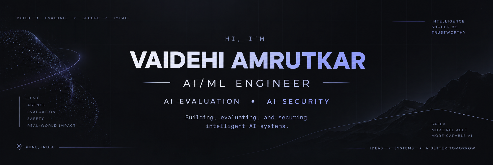
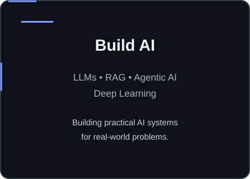
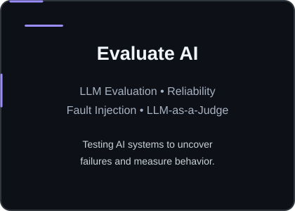
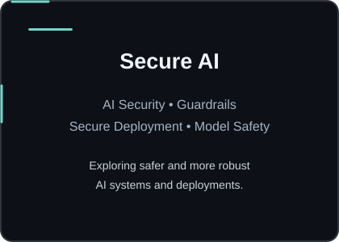

  

<h1 align="center">Hi, I'm Vaidehi Amrutkar 👋</h1>

  <strong>AI/ML Engineer | AI Evaluation | AI Security</strong>

  Building, evaluating, and securing intelligent AI systems.

  
  
  

  📍 Pune, India &nbsp;&nbsp; • &nbsp;&nbsp; 🎓 Computer Engineering Student (2027)

  

I'm a Computer Engineering student and AI/ML Engineer focused on building, 
evaluating, and securing intelligent AI systems.

- 🤖 Building with LLMs, RAG, Agentic AI, and Deep Learning
- 🧪 Exploring AI Evaluation, model reliability, and failure analysis
- 🔐 Interested in AI Security, Guardrails, and secure AI deployment
- 🚀 Building practical AI systems with a focus on reliability and real-world impact
- 🌱 Open-source contributor with 3 merged pull requests
- 💼 Former Generative AI Intern at ARG Supply Tech
- 🎯 Open to AI/ML, AI Evaluation, GenAI, and AI Security opportunities

  

<table>
<tr>

<td width="33%" valign="top" align="center">

</td>

<td width="33%" valign="top" align="center">

</td>

<td width="33%" valign="top" align="center">

</td>

</tr>
</table>

  

<table>
<tr>
<td width="25%" align="center"><b>💻 LANGUAGES</b></td>
<td width="75%">Python · C++ · SQL · Bash</td>
</tr>

<tr>
<td align="center"><b>🧠 AI / ML</b></td>
<td>PyTorch · TensorFlow · Scikit-learn · Transformers</td>
</tr>

<tr>
<td align="center"><b>🤖 AI SYSTEMS</b></td>
<td>LLMs · RAG · Agentic AI · GenAI · NLP · Deep Learning</td>
</tr>

<tr>
<td align="center"><b>🧪 EVALUATION</b></td>
<td>LLM Evaluation · LLM-as-a-Judge · Fault Injection · Agent Evaluation</td>
</tr>

<tr>
<td align="center"><b>🔐 AI SECURITY</b></td>
<td>AI Security · LLM Gateways</td>
</tr>

<tr>
<td align="center"><b>⚙️ FRAMEWORKS</b></td>
<td>LangChain · FastAPI · ONNX</td>
</tr>

<tr>
<td align="center"><b>☁️ CLOUD & INFRA</b></td>
<td>AWS · SageMaker · Docker · Linux</td>
</tr>

<tr>
<td align="center"><b>🔧 TOOLS</b></td>
<td>Git · GitHub</td>
</tr>

</table>

  

<table>
<tr>

<td width="33%" valign="top">

<h3 align="center">🔥 Crucible</h3>

<b>Failure-Mode Evaluation Harness for AI Agents</b>

Stress-tests autonomous agents by injecting faults during execution
to uncover silent failures that standard testing can miss.

<code>Agentic AI</code> · <code>FastAPI</code> · <code>Llama 3.3</code>

<b>4</b> failure modes 
<b>40%</b> faults handled safely vs <b>0%</b> unguarded

</td>

<td width="33%" valign="top">

<h3 align="center">⚡ NeuralScout</h3>

<b>Candidate Search & Ranking Engine</b>

A resource-efficient ranking pipeline combining semantic retrieval,
BM25, cross-encoder reranking, and Reciprocal Rank Fusion.

<code>Python</code> · <code>ONNX</code> · <code>Docker</code>

<b>100K</b> candidates 
<b>2.5 min</b> pipeline runtime 
<b>161</b> automated tests

</td>

<td width="33%" valign="top">

<h3 align="center">🫀 CAC Segmentation</h3>

<b>Coronary Artery Calcium Segmentation</b>

A deep-learning medical imaging pipeline comparing multiple
architectures on clinical DICOM data.

<code>PyTorch</code> · <code>AWS SageMaker</code> · <code>Python</code>

<b>439</b> patients 
<b>0.8820</b> Dice score 
<b>3.8×</b> faster inference

</td>

</tr>
</table>

  

<table>
<tr>
<td width="18%" valign="top" align="center">

<b>Jan 2026</b> 
<b>—</b> 
<b>Mar 2026</b>

</td>

<td width="82%" valign="top">

### Generative AI Intern — ARG Supply Tech Pvt. Ltd.

Built and optimized AI-powered systems for document and supply-chain analysis.

- 🤖 Developed a **Hybrid-RAG pipeline** using Python, LangChain, and ChromaDB
- ⚡ Achieved **2–4 second query latency** through optimized retrieval and querying
- 📉 Reduced manual analysis effort by approximately **40%**
- 🚀 Improved query efficiency by approximately **30%**
- 🔧 Built backend services using **FastAPI** with a React-based interface

`Python` `LangChain` `ChromaDB` `FastAPI` `React` `RAG`

</td>
</tr>
</table>

  

  <b>Contributing to real-world open-source ML infrastructure</b>

<table>
<tr>

<td width="33%" align="center" valign="top">

### 🧠 nnU-Net

Contributed improvements to the open-source medical image segmentation framework.

**3 merged PRs**

</td>

<td width="33%" align="center" valign="top">

### 🔧 Contributions

Focused on improving preprocessing stability and data-pipeline efficiency.

**Merged into main**

</td>

<td width="33%" align="center" valign="top">

### 🚀 Beyond Projects

Working with established open-source projects and contributing improvements that are reviewed and merged.

**Open Source Contributor**

</td>

</tr>
</table>

  

  

  

  <code>AI Security</code>
  <code>Guardrails</code>
  <code>LLM Evaluation</code>
  <code>Model Armor</code>
  <code>Secure AI Deployment</code>
  <code>LLM Gateways</code>
  <code>Data Structures & Algorithms</code>

  

  I'm always open to interesting AI/ML projects, research, collaborations, and opportunities.

  
  
  

